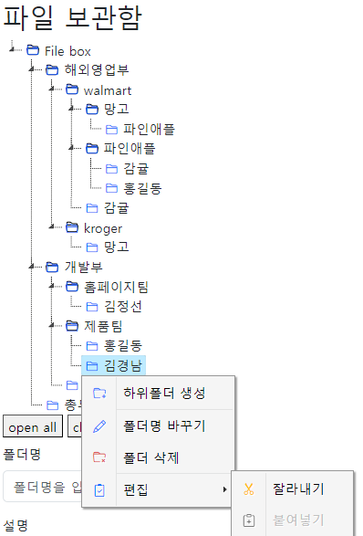

# Olivia

- file box and board
- julia에 포함시키는 것을 염두에 두다.

## history

- 2024-01-24 : 테이블 schema를 수정하다. ERD작성

## board

1. 게시판
2. 파일첨부기능
3. 태그 기능
4. html editor [quill](https://quilljs.com/) 사용

### board todo

1. 페이징 처리
2. 검색어 넣어서 
3. 태그로 검색
4. 사용자의 권한에 따른 버튼 보이기 숨기기

## file-box

1. [jstree](https://www.jstree.com/demo/)를 사용해 보자
2. file보관함으로 필요한 문서들을 웹상에 정리해서 올려 놓는 것

